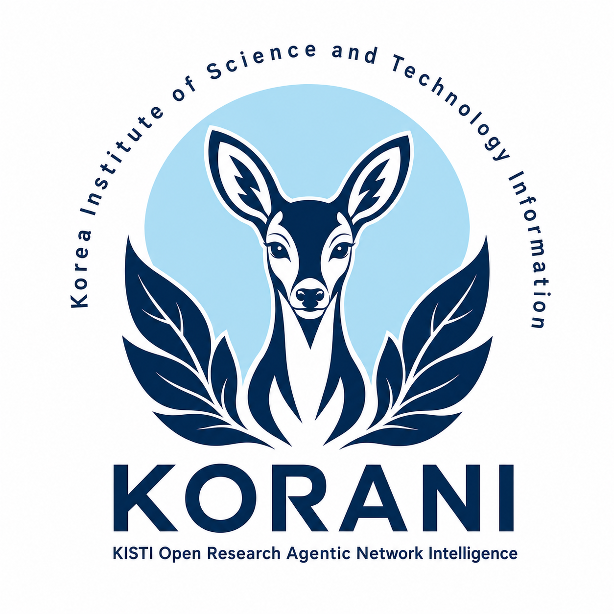

<p align="center">
  
</p>

<h1 align="center">KORANI</h1>
<p align="center"><b>KISTI Open Research Agentic Network Intelligence (KORANI)</b></p>
<p align="center">한국 반도체 연구를 위한 AI 코사이언티스트</p>

---

## What is KORANI?

KORANI is a multi-agent AI framework that acts as a **co-scientist** for
semiconductor engineers and researchers in Korea. The library name comes from
KORANI (고라니), an animal found
almost nowhere else on Earth but thriving in Korea.

It does **not** replace the TCAD simulation software researchers already trust.
Instead, it wraps a team of specialized
LLM agents around the tools people already use:

- **Workflow layer** — automates the tedious work around simulation:
  searching literature and past experiments, generating input files,
  debugging solver errors.
- **Optimization layer** *(planned)* — an LLM-supervised loop that searches
  design parameters, calling the existing solver as a black box.

**The goal is fewer wasted simulation runs and faster time-to-insight — not a
faster physics engine.**

## What can it do? (first objective)

Ask in Korean to rebuild the Python code behind a research paper:

> "이 논문의 소자 시뮬레이션을 DEVSIM으로 재현해줘"

KORANI then:

1. Finds the paper — in its local literature database or on the web
2. Extracts a structured **SimulationSpec** — equations, geometry, boundary
   conditions, material parameters, and the paper's reported results
3. Drafts an evaluation script from the paper's reported figures/tables —
   **you approve it before anything runs**
4. Writes runnable Python code using open-source solvers
5. Executes, compares the output against the paper, and iterates until it
   matches — or tells you honestly why it doesn't

The initial scope is semiconductor TCAD using
[DEVSIM](https://devsim.org). Additional scientific domains may be added later.

## How it works

A **linear pipeline with an escalation ladder** — cheap and deterministic by
default, extra LLM machinery only when a step fails. No agent debate before
code exists, no evolutionary search.

```
Korean request
   │
   A. Understand    task spec (Korean → English internally)
   B. Acquire       literature search: local DB or OpenAlex / Semantic Scholar / CORE
   C. Extract       paper → SimulationSpec (human-reviewable)
   D. Contract      evaluate.py drafted from the paper's results → human approval
   E. Implement     Engineer writes DEVSIM code; Debugger fixes errors
   F. Verify        run → compare against the paper's reported results
   │
   ├─ match     →  code + results returned in Korean; run logged to the DB
   └─ mismatch  →  ① guided debug retry  ② one Proposer↔Critic round  ③ honest failure report
```

Design lineage:

- Multi-agent roles (Evaluator, Engineer, Debugger, Result Analyst) and the
  evaluation-contract idea come from **AgenticSciML**
  (Jiang & Karniadakis, *npj Artificial Intelligence*, 2026).
- The literature search pipeline (SQLite + FAISS + BM25 hybrid retrieval,
  cost-tiered search tools, Korean/English language routing) follows the
  **KoCoScientist** project.

## Models: two profiles — local (default) or API

On first run, KORANI asks which way to run its agents (the choice is saved;
delete `.korani-profile` or pass `--config` to change it):

**1. Local profile — free & open-source (default, `config.yaml`).**
Open-weight models served by **Ollama** — zero token cost, and no user/paper
data leaves your machine. Ollama swaps models in and out of GPU memory
automatically, so the sequential pipeline needs just one GPU (every default
model fits a single 80 GB card). Each agent gets a model matched to its
task, across four model families for diversity:

| Agent (stage) | Model | Why |
|---|---|---|
| Interpreter (A) | **[KONI](https://huggingface.co/KISTI-KONI)** | KISTI's Korean science/tech LLM — the Korean boundary |
| Search Planner / Paper Triage (B) | gemma3:12b / gemma3:27b | cheap expansion + mid-size judgment |
| Spec Extractor (C ⚠) | qwen3:32b | strongest ≤80 GB structured extraction |
| Evaluator (D) | mistral-small3.2:24b | judges the Engineer's work — different family on purpose |
| Engineer / Debugger (E) | qwen2.5-coder:32b / 14b | dedicated coding models |
| Result Analyst (F ⚠) | qwen2.5vl:32b | **vision** — compares plots against the paper |
| Proposer+Critic (escalation) | deepseek-r1:32b | reasoning/thinking model, rarely called |

**2. API profile — Anthropic + OpenAI (`config.api.yaml`).**
A ready-to-use alternative that calls hosted frontier models: Claude
(official `anthropic` SDK) for the Korean boundary, long-document
extraction, coding, and escalation reasoning; GPT for triage, evaluation,
and vision analysis — judging roles deliberately sit on the other vendor
than the roles they judge. Keys are prompted on first run and stored in
`.env` (gitignored, never committed). Note: paper text is sent to the
providers on this profile.

Per-agent model AND provider assignment live in the config files; agent
code never hardcodes either.

KORANI is currently a **CLI, not a product** — no web server, no UI.
(KoCoScientist's FastAPI + WebSocket web interface is a user-friendliness
layer we deliberately haven't carried over yet.)

## Try it: ask in Korean

**1. Install** (Python ≥ 3.10)

```bash
cd KORANI
pip install -e .
```

**2. Pull the local models (Ollama)** — Ollama is the supported local
server; it auto-loads whichever model each pipeline stage requests:

```bash
# KONI (Korean boundary): community GGUF of the latest instruct (20241024).
# (Avoid the RichardErkhov mirror — its files are 0-byte/broken on HF.)
ollama pull hf.co/QuantFactory/KONI-Llama3.1-8B-Instruct-20241024-GGUF:Q4_K_M
ollama cp hf.co/QuantFactory/KONI-Llama3.1-8B-Instruct-20241024-GGUF:Q4_K_M koni
ollama rm hf.co/QuantFactory/KONI-Llama3.1-8B-Instruct-20241024-GGUF:Q4_K_M

# The rest of the roster (see config.yaml; tags drift — verify with `ollama search`)
ollama pull gemma3:12b gemma3:27b qwen3:32b mistral-small3.2:24b \
  qwen2.5-coder:32b qwen2.5-coder:14b qwen2.5vl:32b deepseek-r1:32b
```

> Just smoke-testing? One small model is enough — point every role in
> `config.yaml` at e.g. `qwen2.5:7b` (that's what `config.safe-run.yaml`
> does), or any Korean-capable model for the interpreter
> (`ollama pull exaone3.5`).
>
> Prefer hosted APIs instead? Choose option 2 at the first-run prompt (or
> run with `--config config.api.yaml`) — Anthropic + OpenAI keys are asked
> for once and stored in `.env`. Advanced: vLLM also works for serving the
> big local models faster (tensor parallelism) — it's a `base_url` change
> in `config.yaml`.

**3. Ask** — vague idea, no paper (Mode B):

```bash
python -m korani.cli "단채널 MOSFET의 전달 특성을 재현하고 싶은데, 어떤 논문이 적합할까?"
```

```
============================================================
  KORANI  |  mode B  |  domain: semiconductor
============================================================

[응답]
단채널 MOSFET의 전달 특성을 DEVSIM으로 재현하는 과제로 이해했습니다.

[Task (EN)]
Reproduce the transfer characteristics of a short-channel MOSFET

[Search queries]
  - short-channel MOSFET DEVSIM transfer characteristics
  - open access TCAD MOSFET drift diffusion simulation

[질문]
  - 대상 소자 구조와 채널 길이가 정해져 있나요?
```

Or attach a paper (Mode A — search is skipped):

```bash
python -m korani.cli "이 논문의 소자 시뮬레이션을 DEVSIM으로 재현해줘" --paper paper.pdf
```

In **Mode B** (no paper attached), KORANI continues past interpretation:
the Search Planner expands your question into English queries, OpenAlex and
Semantic Scholar are searched in parallel (free, no API key), duplicates are
merged, and the Paper Triage agent ranks candidates by **reproducibility** —
can this paper's simulation actually be rebuilt in DEVSIM and verified?
You pick from the shortlist:

```
------------------------------------------------------------
  후보 논문 (reproducibility 순위)
------------------------------------------------------------

  [1] (8.7/10, devsim, PDF ✓) Example semiconductor device-modeling paper
      Author et al. (2022) | citations: 42
      → Drift-diffusion model, device dimensions, parameters, and I-V validation curves.
  ...
재현할 논문 번호를 선택하세요 (1-5, 건너뛰려면 Enter):
```

After you pick a paper (or attach one with `--paper`), **stage C** takes over:
the PDF is downloaded (open-access only) or read locally, parsed, and the
Spec Extractor produces a **SimulationSpec** — the equations, geometry,
parameters (with anything missing explicitly marked, never invented),
operating conditions, and the figures/tables the reproduction will be
verified against. Long papers are extracted chunk-by-chunk and merged.
The spec is saved to `data/specs/` and SQLite for review. By default,
`data/` is created under the KORANI project root, so with the standard checkout
it lives at `C:\Users\admin\Desktop\test\KORANI\data`. Each run receives a
readable `work_id` such as `tcad_01_260707`, where the sequence increases for
each TCAD study.

**Stage D** then drafts the evaluation contract: each reported result becomes
a check with an expected value and tolerance, rendered into a standalone
`evaluate.py` under `data/evaluations/<work_id>/`. The contract stays a
**draft until you approve it** — interactively at the prompt, or with
`--approve-contract` for non-interactive runs. Stage E only runs against an
approved contract.

Once approved, **stage E** takes over: you get one chance to resolve the
spec's ambiguities yourself; whatever survives fans out into 2–3 code
variants that resolve them differently. The Engineer writes the
DEVSIM script (it never sees the paper's expected numbers, so it
can't hardcode them), the script runs under a wall-clock timeout, and the
Debugger gets a bounded number of attempts to fix solver errors — every
execution draws from a per-task **solver budget**. Each variant that runs to
completion is immediately scored against the approved `evaluate.py`.
Fixes that worked are distilled into a **failure playbook**
(`data/playbook/`) that future debugging reuses. Artifacts land in
`data/runs/<work_id>/<session>/`.

**Stage F** then verifies the outcome. The Result Analyst compares the
reproduction to the paper — numeric check results, simulated curve data,
and plot images plus renders of the paper pages containing the cited
figures (both default Result Analyst models — `qwen2.5vl` locally, GPT on
the API profile — are vision-capable; a text-only model falls back to
curve data automatically). On a mismatch,
KORANI climbs a bounded **escalation ladder**: ① one Debugger retry guided
by the analyst's diagnosis, ② one Proposer↔Critic round producing up to two
revised plans that re-enter stage E, ③ an honest stop that reports exactly
what was tried and why it failed. Matches are only claimed when the
evidence shows one — 불일치는 불일치로 보고합니다.

> The full **A–F pipeline** is implemented and runs end-to-end from the
> CLI. It has been verified with stubbed models; a live run needs Ollama
> serving the local roster (or API keys for the API profile) plus the
> solver (`pip install devsim`). The two ⚠ risk stages — Spec Extractor and the
> vision-based Result Analyst — still need benchmarking against real
> papers. See `CLAUDE.md` for architecture and design decisions.
> Tip: set `search.mailto` in `config.yaml` (OpenAlex polite pool); behind a
> corporate proxy with SSL inspection, set `SSL_CERT_FILE` to your company CA
> or, for local testing only, `search.verify_ssl: false`.

## References

- Jiang, Q. & Karniadakis, G. *AgenticSciML: collaborative multi-agent systems
  for emergent discovery in scientific machine learning.* npj Artif. Intell.
  (2026). https://doi.org/10.1038/s44387-026-00102-5
- KoCoScientist — Co-STORM-based literature search & research discourse system
  (internal reference codebase)
- [DEVSIM](https://devsim.org) — open-source TCAD device simulator
